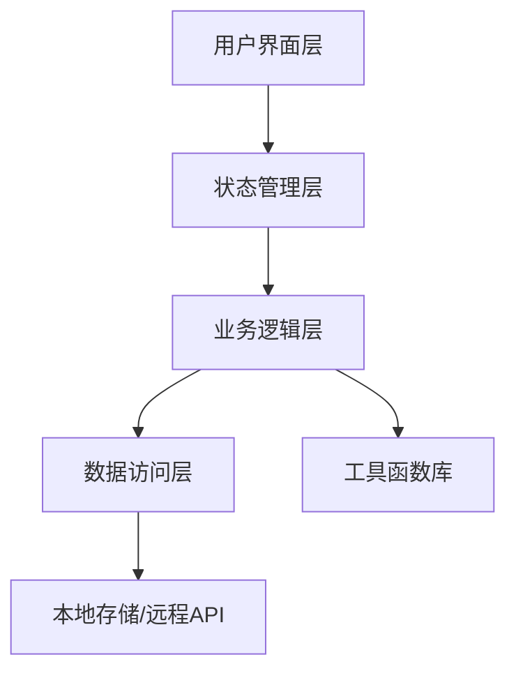
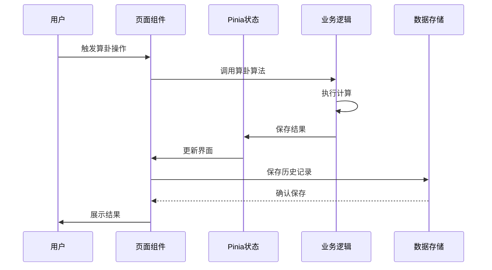
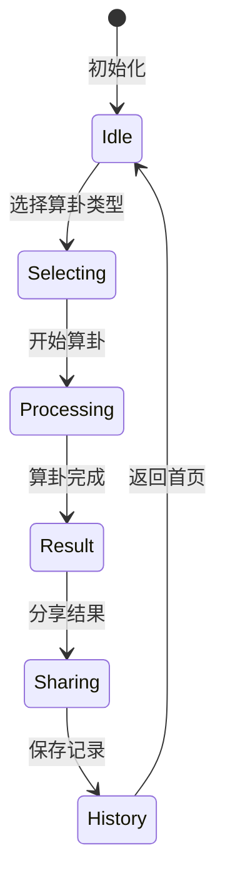
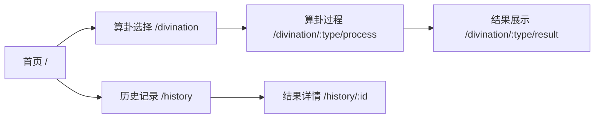

# 赛博算卦网站开发设计文档

## 1. 概述

本项目旨在使用Vue3、TypeScript和Vite构建一个赛博算卦主题的网站，融合现代前端技术与传统算卦文化元素，实现具有视觉吸引力和交互体验的在线算卦平台。

### 1.1 项目目标
- 创建一个现代化的在线算卦平台
- 融合传统算卦文化与赛博朋克视觉风格
- 提供直观易用的用户交互体验
- 实现多种算卦方式的数字化呈现

### 1.2 技术栈
- 前端框架：Vue 3 (Composition API)
- 编程语言：TypeScript
- 构建工具：Vite
- 状态管理：Pinia（Vue 3官方推荐）
- 组件库：自定义赛博朋克风格组件
- 样式方案：SCSS + CSS变量
- 动画库：GSAP
- 图标库：自定义SVG图标
- HTTP客户端：Axios（用于可选的后端集成）
- 国际化：Vue I18n（支持多语言）

### 1.3 项目结构预览
```
src/
├── assets/                 # 静态资源
│   ├── images/             # 图片资源
│   └── icons/              # SVG图标
├── components/             # 公共组件
├── views/                  # 页面组件
├── store/                  # 状态管理
├── utils/                  # 工具函数
├── styles/                 # 全局样式
├── router/                 # 路由配置
├── composables/            # Vue组合式函数
└── App.vue                 # 根组件
```

## 2. 架构设计

### 2.1 整体架构图


### 2.2 技术分层

#### 2.2.1 用户界面层 (UI Layer)
- 页面组件：首页、算卦选择页、结果展示页、历史记录页
- 公共组件：导航栏、算卦动画组件、结果展示组件
- 赛博朋克风格UI组件库

#### 2.2.2 状态管理层 (State Management)
- 使用Pinia进行全局状态管理
- 用户信息状态
- 算卦结果状态
- 历史记录状态

#### 2.2.3 业务逻辑层 (Business Logic)
- 算卦算法实现
- 结果解释逻辑
- 用户交互处理

#### 2.2.4 数据访问层 (Data Access)
- 本地存储（localStorage或IndexedDB）
- 可选的后端API接口

#### 2.2.5 工具函数库 (Utils)
- 随机数生成
- 动画控制
- 数据处理

### 2.3 组件交互流程


## 3. 功能模块设计

### 3.1 核心功能模块

#### 3.1.1 算卦类型模块
- 易经六十四卦算卦：基于六爻算法实现
- 塔罗牌算卦：78张塔罗牌随机抽取
- 签诗算卦：传统签诗随机抽取
- 梅花易数：基于数字和时间的算卦方法

#### 3.1.2 用户交互模块
- 算卦操作界面：触摸/点击交互
- 动画效果展示：赛博朋克风格动画
- 结果解读展示：图文结合的结果解释

#### 3.1.3 历史记录模块
- 算卦历史存储：本地持久化存储
- 历史记录查询：按时间、类型筛选
- 结果导出功能：支持导出为图片或文本

### 3.2 详细组件设计

#### 3.2.1 核心页面组件

**首页 (HomeView.vue)**
- 功能：展示网站介绍、导航至各算卦类型
- 组件：赛博朋克风格标题、导航菜单、背景动画

**算卦选择页 (DivinationSelect.vue)**
- 功能：展示所有可选的算卦类型
- 组件：算卦类型卡片、选择按钮

**算卦过程页 (DivinationProcess.vue)**
- 功能：执行算卦过程，展示动画效果
- 组件：进度指示器、动画展示区、操作按钮

**结果展示页 (ResultView.vue)**
- 功能：展示算卦结果和解释
- 组件：结果展示区、解释文本、分享按钮

**历史记录页 (HistoryView.vue)**
- 功能：查看和管理算卦历史
- 组件：历史记录列表、筛选器、删除按钮

#### 3.2.2 公共组件

**CyberHeader.vue**
- 功能：网站头部导航
- 特性：霓虹灯效果、响应式设计

**DivinationCard.vue**
- 功能：算卦类型展示卡片
- 特性：hover发光效果、赛博朋克边框

**CyberAnimation.vue**
- 功能：算卦过程动画
- 特性：粒子效果、光线流动

**ResultDisplay.vue**
- 功能：结果展示组件
- 特性：渐进式显示、可分享

**HistoryList.vue**
- 功能：历史记录列表
- 特性：可筛选、可删除

### 3.3 组件交互设计

#### 3.3.1 状态流转


#### 3.3.2 用户操作流程
1. 用户访问首页
2. 选择算卦类型
3. 输入问题（可选）
4. 触发算卦过程
5. 查看动画效果
6. 查看算卦结果
7. 保存或分享结果

### 3.3 组件架构

#### 3.3.1 页面组件
```
src/
├── views/
│   ├── HomeView.vue             # 首页
│   ├── DivinationSelect.vue     # 算卦选择页
│   ├── DivinationProcess.vue    # 算卦过程页
│   ├── ResultView.vue           # 结果页面
│   └── HistoryView.vue          # 历史记录页面
```

#### 3.3.2 公共组件
```
src/
├── components/
│   ├── CyberHeader.vue          # 赛博朋克风格头部
│   ├── DivinationCard.vue       # 算卦卡片组件
│   ├── CyberAnimation.vue       # 赛博朋克动画组件
│   ├── ResultDisplay.vue        # 结果展示组件
│   ├── HistoryList.vue          # 历史记录列表
│   └── CyberButton.vue          # 赛博朋克风格按钮
```

#### 3.3.3 状态管理
```
src/
├── store/
│   ├── index.ts                 # Pinia根模块
│   ├── user.ts                  # 用户状态
│   ├── divination.ts            # 算卦状态
│   └── history.ts               # 历史记录状态
```

#### 3.3.4 工具函数
```
src/
├── utils/
│   ├── divinationAlgorithms/    # 算卦算法
│   │   ├── iChing.ts            # 易经算法
│   │   ├── tarot.ts             # 塔罗牌算法
│   │   └── qianShi.ts           # 签诗算法
│   ├── animations/              # 动画效果
│   │   └── cyberEffects.ts      # 赛博朋克效果
│   └── helpers/                 # 辅助函数
│       ├── storage.ts           # 存储工具
│       └── formatter.ts         # 数据格式化
```

#### 3.3.5 路由配置
```
src/
├── router/
│   └── index.ts                 # Vue Router配置
```

## 4. 赛博朋克视觉设计

### 4.1 设计风格要素
- 霓虹色彩搭配（紫色、青色、粉色、洋红）
- 发光效果和粒子动画
- 数字化、未来感元素
- 透明玻璃态设计
- 扫描线效果
- 数字故障效果

### 4.2 动画效果
- 算卦过程的动态效果：粒子汇聚、光线流动
- 结果展示的渐进式动画：文字逐字显示、图像渐现
- 页面切换的过渡动画：赛博朋克风格转场
- 交互反馈动画：按钮点击发光、hover效果

### 4.3 样式系统设计

#### 4.3.1 颜色系统
```scss
// 霓虹色系
$neon-purple: #bc13fe;
$neon-blue: #00f0ff;
$neon-pink: #ff00ff;
$neon-green: #39ff14;
$neon-yellow: #ffff00;

// 背景色系
$cyber-dark: #0c0c14;
$cyber-darker: #080810;
$cyber-panel: #141428;

// 透明度
$glow-opacity: 0.7;
```

#### 4.3.2 字体系统
- 主要字体：未来感无衬线字体
- 装饰字体：科技感字体用于标题
- 等宽字体：用于结果展示

#### 4.3.3 组件样式规范
- 边框：发光边框、渐变边框
- 阴影：多层阴影营造立体感
- 过渡：流畅的hover和focus过渡效果
- 滤镜：发光滤镜、模糊滤镜

#### 4.3.4 响应式设计
- 移动优先设计
- 断点设置：手机、平板、桌面
- 弹性布局：Flexbox和Grid

## 5. 路由设计



### 5.1 路由配置示例
```typescript
const routes = [
  {
    path: '/',
    name: 'Home',
    component: HomeView
  },
  {
    path: '/divination',
    name: 'DivinationSelect',
    component: DivinationSelect
  },
  {
    path: '/divination/:type/process',
    name: 'DivinationProcess',
    component: DivinationProcess
  },
  {
    path: '/divination/:type/result',
    name: 'DivinationResult',
    component: ResultView
  },
  {
    path: '/history',
    name: 'History',
    component: HistoryView
  }
]
```

## 6. 数据模型

### 6.1 算卦记录模型
```typescript
interface DivinationRecord {
  id: string;                 // 记录ID
  type: string;              // 算卦类型
  question: string;          // 用户问题
  result: any;               // 算卦结果
  timestamp: number;         // 时间戳
  interpretation: string;    // 结果解释
  details: object;           // 详细信息
}
```

### 6.2 算卦类型模型
```typescript
interface DivinationType {
  id: string;                // 类型ID
  name: string;              // 类型名称
  description: string;       // 描述
  icon: string;              // 图标
  process: string;           // 算卦过程描述
}
```

### 6.3 用户设置模型
```typescript
interface UserSettings {
  theme: 'dark' | 'light';   // 主题
  animations: boolean;       // 动画开关
  notifications: boolean;    // 通知开关
}
```

## 7. 测试策略

### 7.1 单元测试
- 组件单元测试：使用Vue Test Utils
- 工具函数测试：使用Jest
- 状态管理测试：Pinia状态变更测试
- 算卦算法测试：验证算法正确性

### 7.2 端到端测试
- 用户流程测试：完整的算卦流程
- 交互测试：按钮点击、表单提交等
- 兼容性测试：不同浏览器和设备
- 动画测试：关键动画效果验证

### 7.3 测试工具
- Vue Test Utils：Vue组件测试
- Jest：单元测试框架
- Cypress：端到端测试
- Playwright：跨浏览器测试

### 7.4 测试覆盖率目标
- 组件测试覆盖率：80%以上
- 工具函数测试覆盖率：90%以上
- 核心算法测试覆盖率：95%以上

## 8. 部署方案

### 8.1 构建配置
- 使用Vite进行项目构建
- 优化打包策略
- 静态资源处理
- 环境变量配置

### 8.2 部署环境
- 静态网站托管（GitHub Pages、Vercel、Netlify等）
- CDN加速
- HTTPS支持

### 8.3 性能优化
- 代码分割：按路由分割代码
- 懒加载：组件和资源懒加载
- 图片优化：WebP格式、响应式图片
- 动画优化：使用requestAnimationFrame

### 8.4 CI/CD流程
- 自动化构建和部署
- 代码质量检查
- 自动化测试
- 版本发布流程