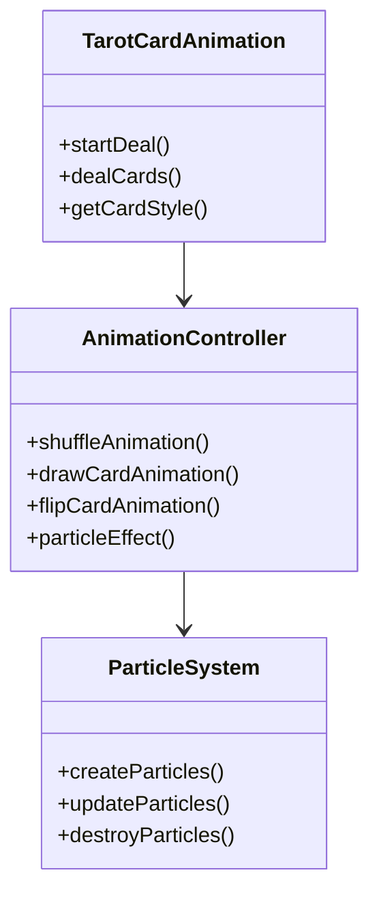

# 塔罗牌动画效果增强设计文档

## 1. 概述

### 1.1 问题描述
当前塔罗牌动画效果较为简单，缺乏类似扑克牌旋转等视觉效果，用户体验不够丰富。

### 1.2 目标
增强塔罗牌动画效果，添加扑克牌旋转、3D翻转、粒子效果等视觉增强，提升用户占卜体验。

## 2. 当前实现分析

### 2.1 现有动画效果
- 简单的平移和旋转动画
- 基础的翻牌效果
- 缺乏3D视觉效果
- 没有粒子系统或光影效果

### 2.2 技术栈
- Vue 3 Composition API
- GSAP 动画库
- SCSS 样式预处理器

## 3. 增强方案设计

### 3.1 动画效果增强点

#### 3.1.1 扑克牌旋转效果
```
实现类似真实洗牌的旋转效果：
- 牌堆旋转洗牌动画
- 单张牌旋转抽出效果
- 多角度旋转展示
```

#### 3.1.2 3D翻牌效果
```
增强翻牌动画的立体感：
- 使用CSS 3D变换
- 添加透视效果
- 增加光影变化
```

#### 3.1.3 粒子系统
```
添加魔法粒子效果：
- 抽牌时的星光粒子
- 翻牌时的魔法光效
- 完成时的庆祝粒子
```

### 3.2 组件架构调整

#### 3.2.1 新增动画控制模块


## 4. 具体实现方案

### 4.1 扑克牌旋转效果实现

#### 4.1.1 洗牌动画增强
- 添加牌堆3D旋转效果
- 实现多角度洗牌动画
- 增加弹性缓动函数

#### 4.1.2 抽牌旋转效果
- 单张牌螺旋式抽出动画
- 添加随机旋转角度
- 实现Z轴深度变化

### 4.2 3D翻牌效果实现

#### 4.2.1 翻牌动画优化
```javascript
// 当前翻牌代码
gsap.to(cardElements[i], {
  rotationY: 180,
  duration: 0.6
})

// 增强后翻牌代码
gsap.to(cardElements[i], {
  rotationY: 180,
  rotationX: 10,
  duration: 0.8,
  ease: "elastic.out(1, 0.3)"
})
```

#### 4.2.2 光影效果增强
- 添加动态阴影
- 实现光照变化
- 增加反射高光

### 4.3 粒子系统实现

#### 4.3.1 粒子类型
| 粒子类型 | 触发时机 | 效果描述 |
|---------|---------|---------|
| 洗牌粒子 | 洗牌阶段 | 星光闪烁效果 |
| 抽牌粒子 | 抽牌阶段 | 魔法光圈扩散 |
| 翻牌粒子 | 翻牌阶段 | 金色粒子飞舞 |
| 完成粒子 | 完成阶段 | 彩色烟花效果 |

#### 4.3.2 粒子系统API
```typescript
interface ParticleConfig {
  type: 'sparkle' | 'magic' | 'glow' | 'firework'
  count: number
  duration: number
  color: string[]
  size: { min: number, max: number }
}

class ParticleSystem {
  create(config: ParticleConfig): void
  animate(): void
  destroy(): void
}
```

## 5. 样式系统增强

### 5.1 CSS动画增强
```scss
.tarot-card {
  // 添加3D透视
  transform-style: preserve-3d;
  perspective: 1000px;
  
  // 增强过渡效果
  transition: all 0.8s cubic-bezier(0.175, 0.885, 0.32, 1.275);
  
  // 添加3D旋转类
  &.rotating {
    animation: rotate3d 2s ease-in-out;
  }
}

@keyframes rotate3d {
  0% { transform: rotateY(0) rotateX(0); }
  25% { transform: rotateY(90deg) rotateX(10deg); }
  50% { transform: rotateY(180deg) rotateX(0); }
  75% { transform: rotateY(270deg) rotateX(-10deg); }
  100% { transform: rotateY(360deg) rotateX(0); }
}
```

### 5.2 卡牌样式增强
- 添加金属质感边框
- 实现动态光泽效果
- 增加卡牌纹理背景

## 6. 性能优化考虑

### 6.1 动画性能
- 使用CSS硬件加速
- 限制同时运行动画数量
- 合理使用requestAnimationFrame

### 6.2 粒子系统优化
- 对象池复用粒子
- 自动销毁超出生命周期粒子
- 低性能设备降级处理

## 7. 测试方案

### 7.1 动画效果测试
- 验证各阶段动画流畅性
- 检查不同设备兼容性
- 测试动画中断处理

### 7.2 性能测试
- 监控动画帧率
- 检查内存占用情况
- 验证移动端性能表现

## 8. 集成方案

### 8.1 组件接口调整
```typescript
// 新增属性
interface TarotCardAnimationProps {
  enableEnhancedAnimation?: boolean  // 是否启用增强动画
  particleEffects?: boolean         // 是否启用粒子效果
  animationSpeed?: 'slow' | 'normal' | 'fast'  // 动画速度
}

// 新增事件
interface TarotCardAnimationEmits {
  (e: 'animationStart'): void
  (e: 'animationComplete'): void
  (e: 'particleComplete'): void
}
```

### 8.2 配置选项
- 提供动画开关控制
- 支持自定义动画速度
- 允许禁用粒子效果（性能考虑）